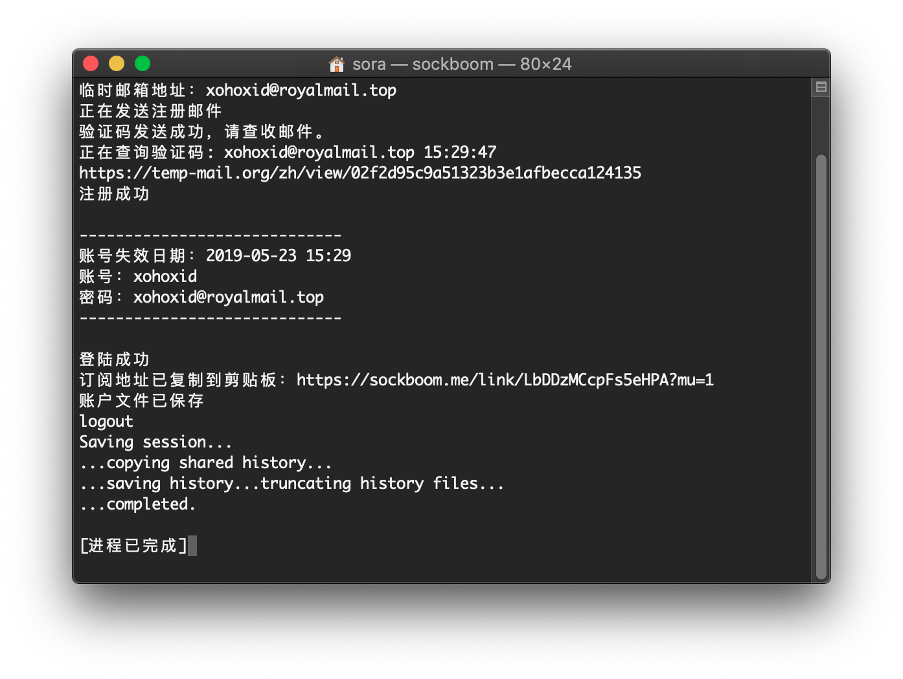

# [SockBoom](http://sockboom.net) 注册机
没正儿八经学过Python 各种库确实方便的很
面向百度写了个梯子网站的注册机(新用户送一天时长) 方便科学上网
主要实现就是临时邮箱 用的 [Temp Mail](https://temp-mail.org/zh/)
* dist目录下有打包好的mac版可以直接使用
    >需要Windows版自己pyinstaller一下就ok啦
* 注册好会在程序目录生成账号文件(Mac下在用户文件夹中)
* 有机会就做成网站形式

